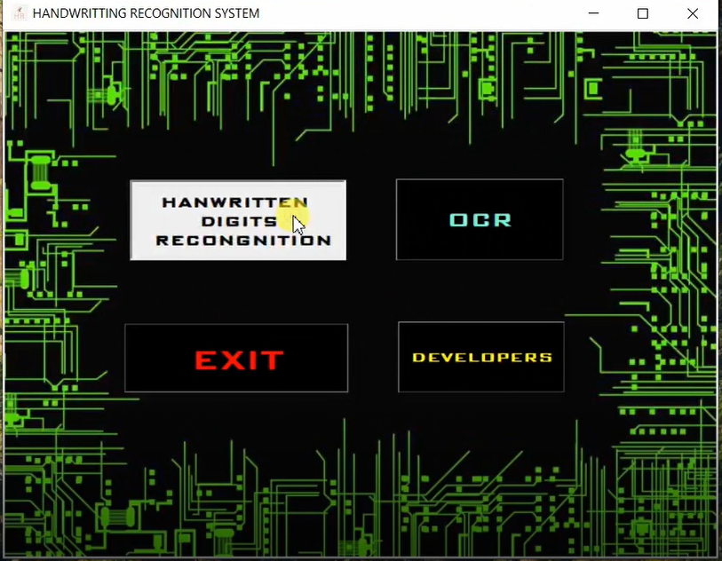
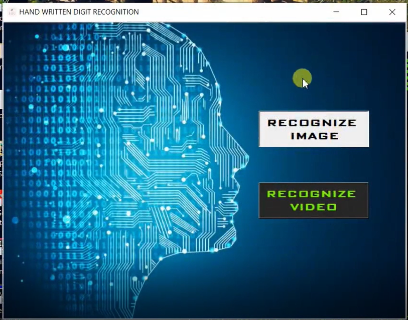
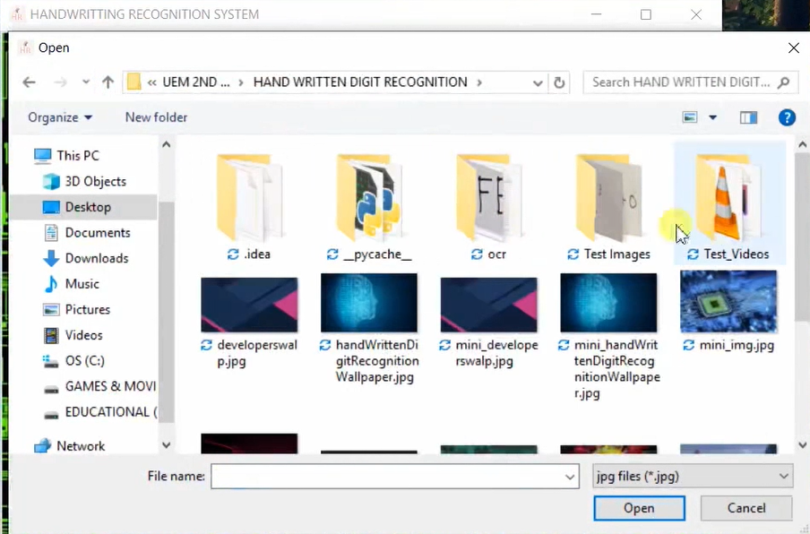
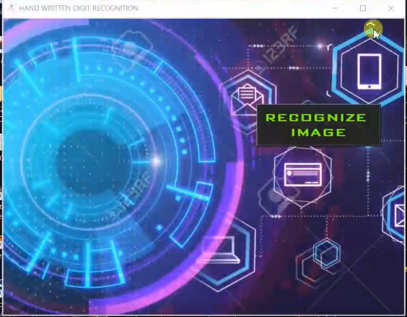
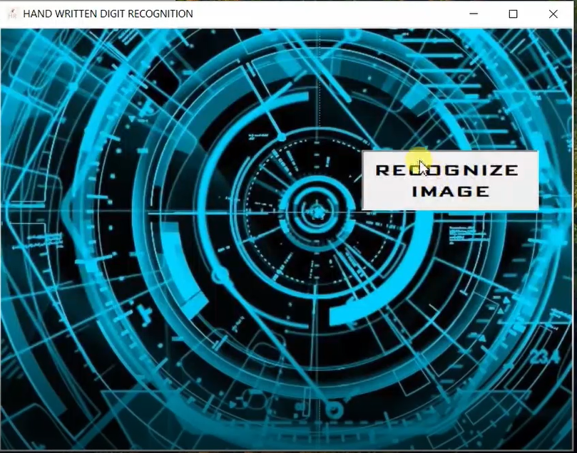
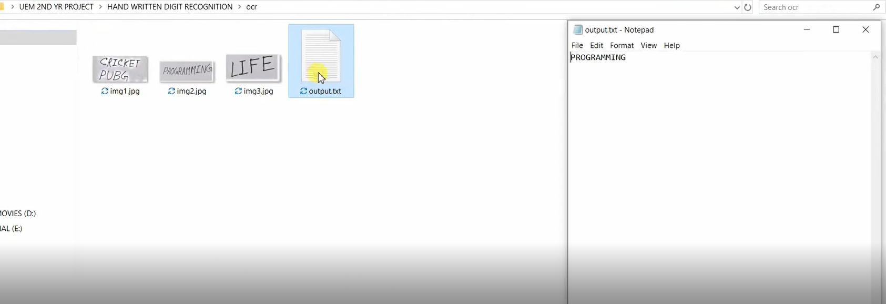

# PROJECT-1-UEMK-HANDWRITING RECOGNIZER :star_struck:

[](https://shields.io/) 

***This new Web application is created by Biswarup Bhattacharjee, student of BTECH, in University of Engineering and Management, Kolkata.***

**Email Id: bbiswa471@gmail.com.** 

**Contact No: 916290272740.** 

[](https://www.facebook.com/biswarup.bhattacharjee.5811) [](https://github.com/biswa2210)

## About :point_down: 
I have a handwritten recognizer for recognising both handwritten text and OCR. Python-tesseract is used to recognize and read the text. In handwriting recognition (HWR) the device interprets the user's handwritten characters or words into a format that the computer understands (e.g., Unicode text). The input can be from paper documents, images, touch-screens and other devices. There are many levels of HWR, starting from the recognition of simplified individual characters to the recognition of whole words and sentences of cursive handwriting. Character recognition often involves scanning a form or document. This means the individual characters contained in the scanned image will need to be extracted. After the extraction of individual characters occurs, a recognition engine is used to identify the corresponding character. OCR systems consist of following major stages : • Classification • Post-processing • Feature Extraction. This Handwriting recognition is used for numerous applications such as : reading postal addresses, bank check amounts, and forms. Furthermore, OCR plays an important role for digital libraries, allowing the entry of image textual information into computers by digitization, image restoration, and recognition methods.

:point_right: [click here to read Project1 Research Paper](https://github.com/biswa2210/PROJECT-1-UEMK/blob/master/3rdSemProject1ResearchPaper.pdf)
## Purpose :point_down:

## Use :point_down:

## Applications and Future Scopes:point_down:
• Postal address reading.<br>
•Check reading.<br>
•Census data collection and processing.<br>
•Image document reading.<br>
•Digitizing old books in editable form.<br>
•Extended research:<br>
   • text to speech conversion (e-book reading).<br>
   •Visually impaired should be able to access computers in their native language.<br>
• Develop an online system for searching hundreds of books over the Web.<br>
• Recognition and retrieval of complex documents (such as camera-based, handwritten, etc.).<br>
• Apply advanced image preprocessing techniques to enhance image quality for large collection of document images.<br>
• Retrieval of documents in presence of OCR errors and scope for hybrid approaches.<br>
## Folder Structure :point_down:
```bash

```                       

## Making :point_down:
 
## Screenshots :point_down: 
<div align="center">
 <a href="hr1.PNG"></a> <a href="hr2.PNG"></a>

<a href="hr3.PNG"></a> <a href="hr4.PNG"></a>

<a href="hr5.PNG"></a> <a href="hr6.PNG"></a>

<a href="hr7.PNG"></a> <a href="hr8.PNG"></a>
</div>

